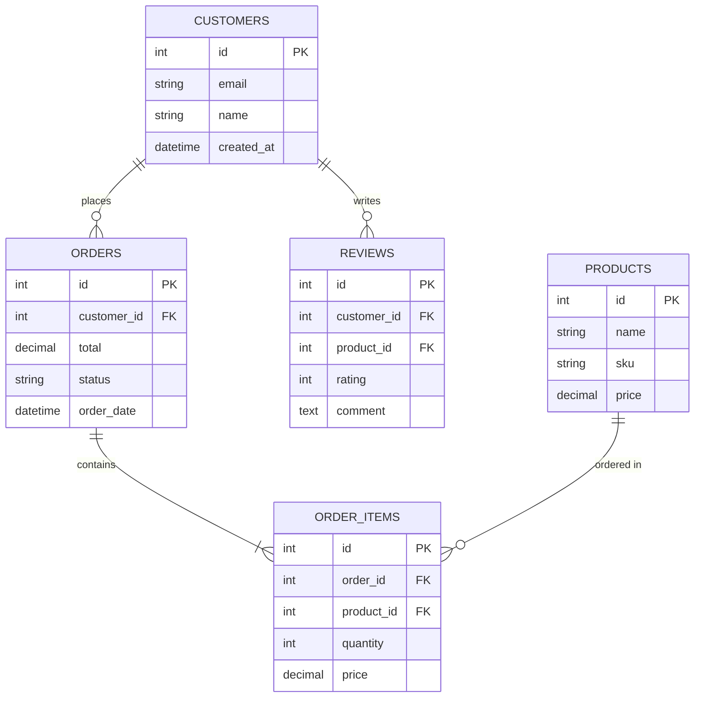
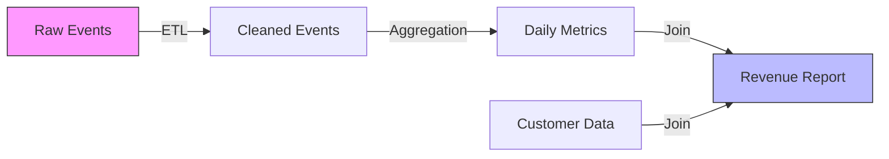
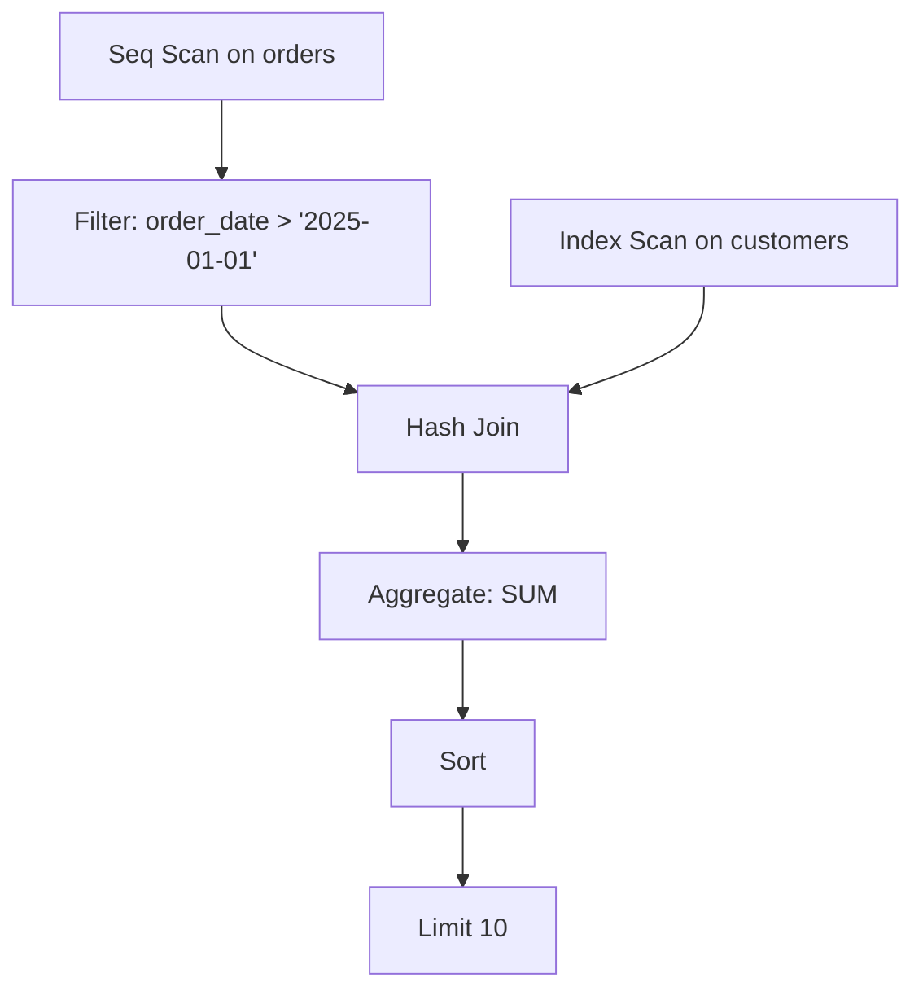
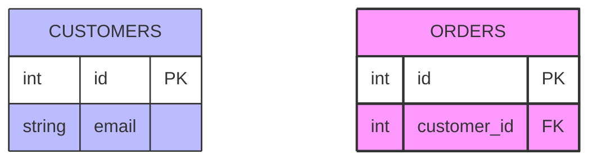

# Mermaid Visualization

Generate interactive, draggable diagrams from database schemas using Mermaid syntax.

## Command: @deepdive visualize

```
@deepdive visualize <type> [options]

Types:
  schema      - Entity Relationship Diagram of all tables
  erd         - Focused ERD for specific tables
  lineage     - Data flow and dependency diagram
  query-plan  - Visualize SQL query execution plan

Options:
  --tables t1,t2    - Limit to specific tables
  --output path     - Custom output path
  --open            - Auto-open in browser (default: true)
```

## Generated Files

All diagrams saved to `.deepdive/diagrams/`:

```
.deepdive/diagrams/
├── schema-2025-01-31.mmd
├── erd-customers-orders.mmd
├── lineage-revenue-calc.mmd
└── query-plan-001.mmd
```

## Schema Diagram (ERD)

Generate full database ERD:



## Python Generation Script

```python
#!/usr/bin/env python3
# scripts/generate_mermaid.py

import json
import sys
from datetime import datetime

def generate_erd(schema, output_path, tables=None):
    """Generate Mermaid ERD from schema"""
    
    if tables:
        # Filter to specific tables + their related tables
        relevant_tables = set(tables)
        for table in tables:
            if table in schema['tables']:
                for fk in schema['tables'][table].get('foreign_keys', []):
                    relevant_tables.add(fk['references_table'])
        tables_to_render = relevant_tables
    else:
        tables_to_render = set(schema['tables'].keys())
    
    mermaid = ["erDiagram"]
    
    # Add relationships
    for table in tables_to_render:
        if table not in schema['tables']:
            continue
            
        table_info = schema['tables'][table]
        
        for fk in table_info.get('foreign_keys', []):
            ref_table = fk['references_table']
            if ref_table in tables_to_render:
                # Determine relationship cardinality
                card = "||--o{"  # One-to-many default
                mermaid.append(f"    {table.upper()} {card} {ref_table.upper()} : references")
    
    # Add entities
    for table in tables_to_render:
        if table not in schema['tables']:
            continue
            
        table_info = schema['tables'][table]
        mermaid.append(f"\n    {table.upper()} {{")
        
        pk_columns = {pk['column'] for pk in table_info.get('primary_key', [])}
        
        for col in table_info['columns']:
            col_name = col['name']
            col_type = col['type']
            
            # Mark primary keys
            if col_name in pk_columns:
                mermaid.append(f"        {col_type} {col_name} PK")
            else:
                mermaid.append(f"        {col_type} {col_name}")
        
        mermaid.append("    }")
    
    return "\n".join(mermaid)

def save_and_open(mermaid_content, output_path):
    """Save .mmd file and open in browser"""
    import os
    import webbrowser
    
    # Save file
    with open(output_path, 'w') as f:
        f.write(mermaid_content)
    
    # Open with mermaid.live
    encoded = mermaid_content.replace('\n', '%0A').replace(' ', '%20')
    url = f"https://mermaid.live/edit#pako:{encoded}"
    webbrowser.open(url)
    
    return output_path

if __name__ == "__main__":
    import argparse
    
    parser = argparse.ArgumentParser()
    parser.add_argument('type', choices=['schema', 'erd', 'lineage'])
    parser.add_argument('--schema-file', required=True)
    parser.add_argument('--output', required=True)
    parser.add_argument('--tables', help='Comma-separated table names')
    
    args = parser.parse_args()
    
    # Load schema
    with open(args.schema_file) as f:
        schema = json.load(f)
    
    # Generate
    tables = args.tables.split(',') if args.tables else None
    mermaid = generate_erd(schema, args.output, tables)
    
    # Save and open
    result = save_and_open(mermaid, args.output)
    print(f"Generated: {result}")
```

## Lineage Diagram

Show data flow:



## Query Plan Visualization

Visualize SQL execution:



## Custom Styling

Add CSS classes for better visuals:



## Multi-Diagram Projects

For complex schemas, generate multiple focused diagrams:

```python
diagrams = [
    ('customer-journey', ['customers', 'orders', 'order_items', 'products']),
    ('analytics', ['events', 'sessions', 'pageviews']),
    ('admin', ['users', 'roles', 'permissions']),
]

for name, tables in diagrams:
    output = f".deepdive/diagrams/{name}.mmd"
    mermaid = generate_erd(schema, output, tables)
    save_and_open(mermaid, output)
```

## Interactive Features

Mermaid.live provides:
- Drag to rearrange nodes
- Zoom and pan
- Export PNG/SVG
- Edit syntax live
- Share links

## Best Practices

1. **One diagram per concern**: Don't cram everything into one diagram
2. **Table subsets**: Use --tables for focused diagrams
3. **Naming**: Use descriptive filenames (erd-customers-orders.mmd)
4. **Version control**: Commit .mmd files to track schema evolution
5. **Documentation**: Include diagram links in README.md

## Integration with @deepdive

```
User: "Show me the customer schema"
→ Read schema-introspection.md
→ Run generate_mermaid.py schema
→ Output: .deepdive/diagrams/schema-YYYYMMDD.mmd
→ Open browser to mermaid.live
→ Return file path to user
```
